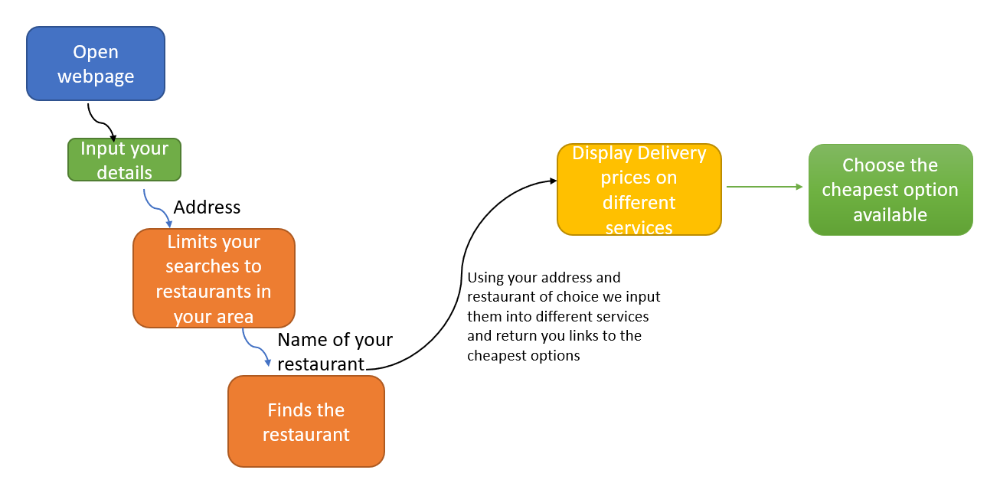

Motivation 

When you want to order food online, it is a hassle to figure out which food delivery service gives you the best deal. Having to sift through multiple applications in search of the cheapest option can be troublesome, especially with surge pricing causing prices of food delivery services to be inconsistent.

Many of us have simply gone with the first option we find simply to avoid the hassle of using multiple applications and we hope to change this by giving consumers a way to get the best bang for their buck in the shortest time possible. 

Aim 

We hope to make the comparison between ordering services easier with the use of a simple website that will link you to the cheapest delivery option. 
Scope

A website capable of displaying the delivery prices of each food delivery option and directing you to the application with the cheapest delivery price will be the main deliverable. 

Additionally, a telegram bot which gives suggestions of different restaurants based on what cuisine the consumer wants, along with the suggestion of the best restaurant to order from, will assist the user in making a decision on which restaurant to order from.

1.Telegram Bot

Allow users to obtain a suggestion on a restaurant close to their area based on which cuisine they prefer

2.Website

Allow users to view a breakdown of the price of food delivery from different applications so that they make an informed decision on which food delivery service to use.

Provide Users with a most popular Restaurant in their area to act as a suggestion into what they can order. 
    
Project Log:    
|S/N |Task                     |Date       |Orbitee 1 (hrs)|Orbitee 2 (hrs)|Remarks                                               |
|--- |-------------------------|-----------|---------------|---------------|------------------------------------------------------|
|1   |Team meeting             |13/05/2021 |       3       |      3        |Team meeting to create the overall idea of the project|
|2   | Mission Control day 1   |15/05/2021 |       4       |      4        |Workshop for HTML and React/JS                        | 
|3   | Lift off                |17/05/2021 |       6       |      6        |Creation of poster and Video for Lift-off submission  |
|4   | Mission Control day 2   |22/05/2021 |       2       |      2        |Workshop for  React/JS                                | 
|5   | Self study              |24/05/2021 |       2       |      2        |Learning how to create a website capable of searching through a delivery catalogue |  
|6   | Programming at home     |25/05/2021 |       4       |      4        |Creation of a basic HTML website prototype  | 
|7   |Team meeting             |27/05/2021 |       2       |      2        |Worked on Milestones   |
|8   |Team meeting             |27/05/2021 |       4       |      4        |Worked on Milestones   | 
|9   |learning to use a scraper|05/06/2021 |       8       |      8        |Tried to adapt price scrapers to run on foodpanda   |
|10  |Attempted to use a scraper using scrapy|09/06/2021 |       4       |      4        |First attempt at price scrapping from foodpanda   | 
|11  |Team meeting             |14/06/2021 |       2       |      2        |Address growing issues with using price scrappers   | 
|12  |USe grab API to get delivery quotes|16/06/2021 |       6       |      6        |Tried to gain access to the grab api but did not receive access as we were not companies   | 

Total Hours |Orbitee 1|Orbitee 2|
|-----------|---------|---------|
112|56|56

Poster link: https://drive.google.com/file/d/1X4jX5AFzbi1WddDCjFDgb9DUUd9Ski_u/view?usp=sharing

Proposal Video link: https://drive.google.com/file/d/183N4AXq_sP9BLhwZRFSWX2TohwDHvM-6/view?usp=sharing 

Demo Video link: https://drive.google.com/file/d/1iaeWAsgxNPhzju_tblBrj4inLd8KFesF/view?usp=sharing

 
